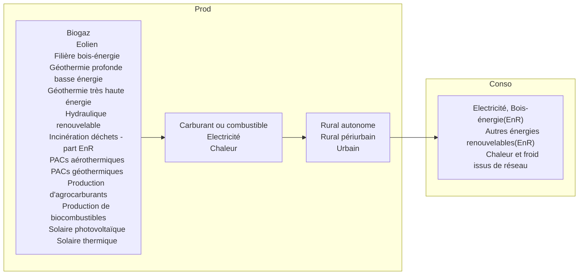

# dge_hackaviz2024

#### Production totale par année

```sql
SELECT an, sum(prod) prod
FROM ${tbprod}
GROUP BY an 
ORDER BY an 
```

| an    |  prod(Gwh) |
|-------|-----------:|
| 2019  |  41 387,31 |
| 2020  |  41 038,23 |
| 2021  |  44 036,41 |
| 2022  |  43 736,35 |
| Total | 170 198,31 |

--

Aller de la production détaillée, en passant par les vecteurs (Electricité, Chaleur, Carburant ou combustible), puis les formes d'EPCI (Urbain, rural périurbain, rural autonome) vers les consos par catégories (Electricité, Bois-énergie (EnR), Autres énergies renouvelables (EnR), Chaleur et froid issus de réseau).




#### Création d'éléments pour un graphique

```sql
select json_group_array(datas) from (
	SELECT * FROM (
	-- Prod - detail -> vecteur
	select json_group_array({'from': detail,'to': vecteur,'weight': round(prod, 2), 'typ': 'prod_1'}) as datas, 1 AS ord from(
		select detail, vecteur, sum(prod) prod 
		from ${tbprod}
		group by vecteur, detail
		order by sum(prod) DESC, vecteur, detail
	) a
	UNION
	-- Prod - vecteur --> forme
	select json_group_array({'from': vecteur,'to': forme,'weight': round(prod, 2), 'typ': 'prod_2'}) as datas, 2 AS ord from(
		select vecteur, forme, sum(prod) prod 
		from ${tbprod}
		group by forme, vecteur
		order by sum(prod) DESC, forme, vecteur
	) b
	UNION
	-- Conso - forme --> categorie avec ratio
	select json_group_array({'from': forme,'to': categorie,'weight': round(conso, 2), 'typ': 'conso_1'}) as datas, 3 AS ord from(
		with conso_ratio as (
			select c.*, r.ratioenr
			from ${tbconso} c 
			inner join ${tbratio} r on r.insee = c.insee and r.forme = c.forme and r.an = c.an
		)
		select forme, categorie,
			sum( case 
				when categorie IN ('Electricité', 'Chaleur et froid issus de réseau') then (conso*ratioenr/100) 
				else conso
				end
				)/1000 conso --, sum(conso)/1000 consotot
		from conso_ratio
		WHERE categorie in('Bois-énergie (EnR)', 'Autres énergies renouvelables (EnR)', 'Electricité', 'Chaleur et froid issus de réseau')
		group by forme, categorie
		order by forme, categorie
	) c
	) ORDER BY ord
) tout
```

avec 
@set tbprod = 'C:\UwAmp\www\dge_hackaviz2024\data_originales\prod.json'

@set tbconso = 'C:\UwAmp\www\dge_hackaviz2024\data_originales\conso.json'

@set tbratio = 'C:\UwAmp\www\dge_hackaviz2024\data_originales\ratio.json'

@set tbepci = 'C:\UwAmp\www\dge_hackaviz2024\data_originales\epci.geojson'