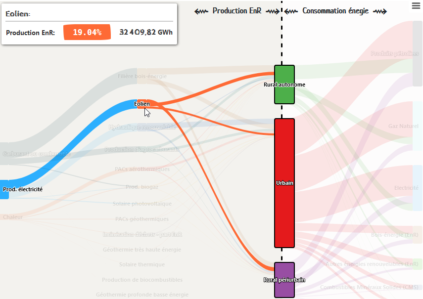
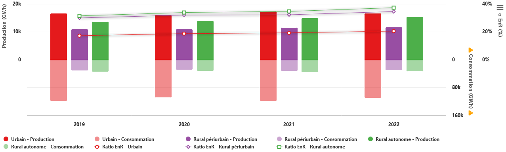

---
puppeteer:
    displayHeaderFooter: false
    margin:
      top: '5mm'
      right: '5mm'
      bottom: '5mm'
      left: '5mm'
---

### Présentation

	

		<strong style="color:#000000; font-size:13px;">Loïc Donot</strong>
	

	

		<strong style="font-size:11px;color:#000000">Développeur chargé de la valorisation des données</strong>
	

	<table style="border-collapse:collapse;border:none;margin: 10px 0 0 0;">
		<tr>
			<td>
				<table class="sddt31" id="graph" style="border-collapse:collapse;border:none;width:42px; height:30px; font-size:0; padding:0; margin:0 10px 0 0;">
					<tr>
						<td valign="bottom" style="border-left:1px solid #666 !important;border-bottom:1px solid #666 !important; width:7px; padding:1px;">
							
&nbsp;

						</td>
						<td valign="bottom" style="border-bottom:1px solid #666 !important; width:7px; padding:1px;">
							
&nbsp;

						</td>
						<td valign="bottom" style="border-bottom:1px solid #666 !important; width:7px; padding:1px;">
							
&nbsp;

						</td>
						<td valign="bottom" style="border-bottom:1px solid #666 !important; width:7px; padding:1px;">
							
&nbsp;

						</td>
						<td valign="bottom" style="border-bottom:1px solid #666 !important; width:7px; padding:1px;">
							
&nbsp;

						</td>
						<td valign="bottom" style="border-bottom:1px solid #666 !important; width:7px; padding:1px;">
							
&nbsp;

						</td>
					</tr>
				</table>
			</td>
			<td valign="middle">
				<strong style="font-size:11px;color:#000000">Mission Innovation et Partenariats</strong>
				 
				<strong style="font-size:11px;color:#000000">Gestion technique de la donnée</strong>
			</td>
		</tr>
	</table>
		

			Direction départementale des territoires de la Haute-Garonne
        

    

### Visualisation 

**#1** 

Il s'agit d'une page web composée de 3 représentations graphiques commentées.
Le degré d'urbanisation des EPCI (attribut `forme`) est mis en avant dans chacun des graphiques.

La première, sous forme de flux, tente de montrer, ou sont produites et consommées les EnR (bienque les données ne permettent pas de distinguer la part d'EnR consommée).
Elle expose dans sa partie gauche
- la répartition des quantités d'EnR produites par filière
- leurs destinations de consommation (carburant, électricité, chaleur) sur 4 ans. 

La partie droite représente les consommations d'énergie par poste (Pétrole, gaz ...). 

Production et consommation sont séparés par un bloc "forme d'EPCI" (Urbain, rural périurbain et rural autonome) qui permet de distinguer 
- ou sont produites les EnR, et 
- ou sont consommées les énergies.

En survolant avec la souris les éléments du graphique, une infobulle précise la quantité d'énergie produite ou consommée et le pourcentage d'énergie de l'élément par rapport aux éléments de la même colonne. 

En regardant le graphique dans son ensemble, le déséquilibre entre production d'EnR et consommation globale d'énergie apparaît.

<!-- pagebreak -->

**#2** 
 La deuxième représentation, sous forme de barres, expose les évolutions par année et toujours par **degré d'urbanisation** de la production d'EnR, de la consommation d'énergie et du ratio EnR. !!! Les données de consommations, très supérieures à celles de production, sont représentées à une échelle plus petite.

Ce graphique, qui comporte 3 axes Y, donne beaucoup d'informations, mais nécessite un minimum d'attention.

**#3** 
Le troisième graphique exprime, pour chaque EPCI en 2022, le rapport entre la population et le ratio EnR. On retrouve les mêmes couleurs que précédemment pour signaler le degré d'urbanisation. Un zoom sur la partie la plus dense du graphique permet d'y voir plus clair.

Cette représentation met en avant un meilleur ratio EnR dans les zones moins peuplées.
51% des EnR sont produites dans des zones peuplées de 32% de la population.

### Processus de création

**#1 Examen des données et choix de l'axe de travail**
- Avec l'aide de la documentation fournie, j'essaie de comprendre ce que ces données décrivent.
Je ne suis pas spécialiste de la thématique, **il faudra éviter un hors sujet**.

- je fais des requêtes sur les données ... **DuckDB** est un super outil pour consulter en SQL des données à plat (fichiers), même géographiques.

- J'affiche les données sous **QGIS**, en tentant de trouver des logiques géographiques aux données.

- J'essaie de trouver un point de vue qui me parle, une cause à défendre et avec de la chance, un truc marrant à dire ... VEnR, EnRVent ... 
-> Je décide d'axer la présentation sur le **degré d'urbanisation** des EPCI, en espérant montrer que les petits nourrissent les grands ... Bon, c'est pas si simple.

- Je relis bien la doc pour éviter des écueils du style 
    - production et consommation ne sont pas exprimées dans la même unité
    - La consommation d'énergie est globale, pas seulement EnR.

Bref, tous ces petits pièges vicieux qu'affectionnent en général les organisateurs de concours.

**#2 Choix technologique et réalisation**

Je savais dès le départ que je voulais réaliser une visualisation sous forme de page web.

Je travaille souvent avec la librairie **Highcharts.js** qui permet de réaliser beaucoup de types de graphiques différents, jolis, dynamiques et très personnalisables ... Gratuite pour des utilisations non lucratives.

Cela faisait un moment que je voulais faire un graphique de type **sankey**, et là, il y a matière à montrer le flux des EnR, depuis leur production (champ `détail`), en passant par ce en quoi elles sont utilisées (`vecteur`), puis par qui les utilisent (`forme`), et enfin, leur dilution dans la consommation globale.

Pour conforter le propos, j'ai réalisé 2 autres graphiques plus classiques, avec la même librairie.

**Concernant la mise en page**, le framework css **Bootstrap** offre des composants facilitant le positionnement de blocks responsives.

J'ai quand même dû personnaliser le style de la page pour permettre une impression correcte sur 3 pages A4.